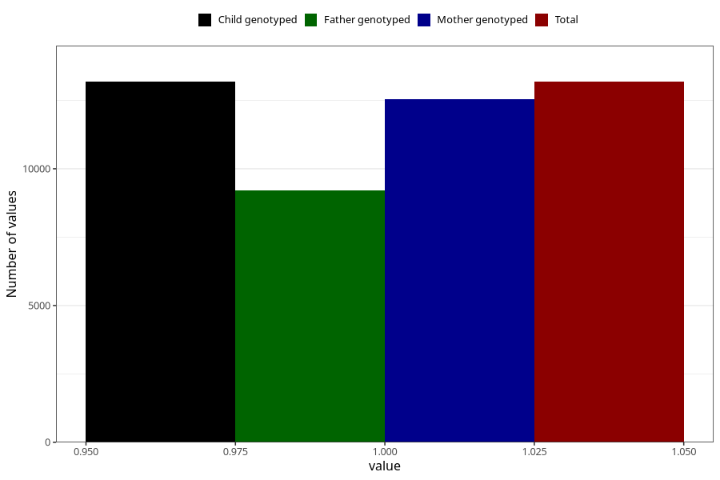

# formula_12_14m
Variable mapping to `EE18` in `Skjema5_18mnd_v12`.
- Number of values:

| Value | Total | Child genotyped | Mother genotyped | Father genotyped |
| ----- | ----- | --------------- | ---------------- | ---------------- |
| Missing | 62128 | 62128 | 59097 | 40889 |
| Non-missing | 13180 | 13180 | 12553 | 9195 |
| 1 | 13180 | 13180 | 12553 | 9195 |

