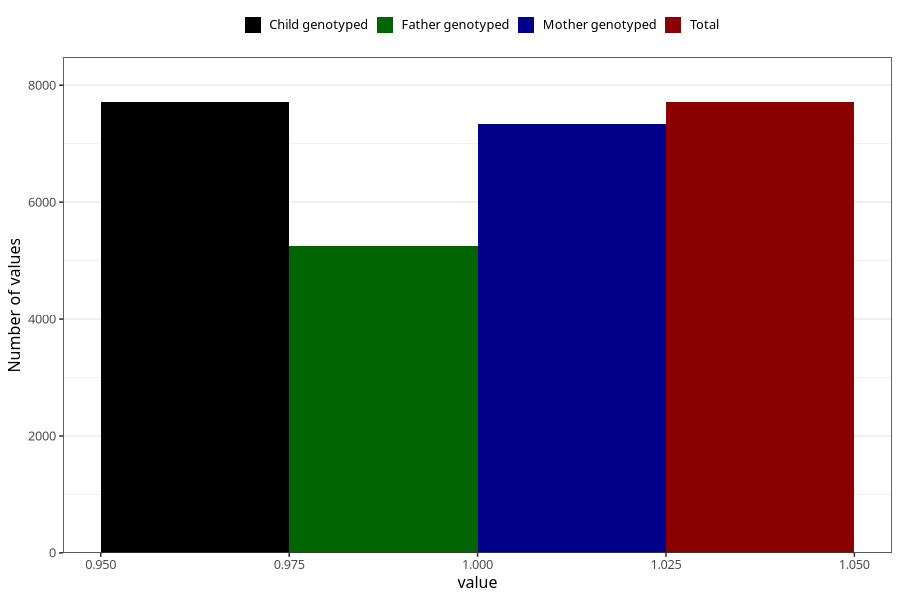

# formula_nan_2m
Variable mapping to `DD72` in `Skjema4_6mnd_v12`.
- Number of values:

| Value | Total | Child genotyped | Mother genotyped | Father genotyped |
| ----- | ----- | --------------- | ---------------- | ---------------- |
| Missing | 67598 | 67598 | 64312 | 44831 |
| Non-missing | 7710 | 7710 | 7338 | 5253 |
| 1 | 7710 | 7710 | 7338 | 5253 |

