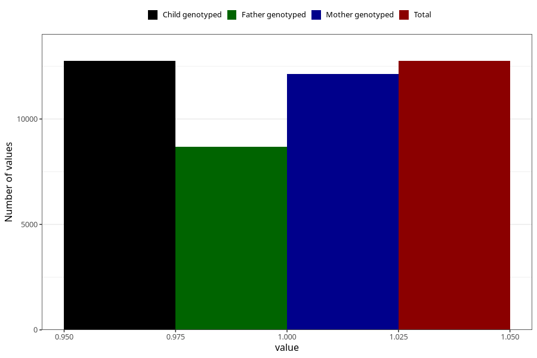

# formula_nan_4m
Variable mapping to `DD74` in `Skjema4_6mnd_v12`.
- Number of values:

| Value | Total | Child genotyped | Mother genotyped | Father genotyped |
| ----- | ----- | --------------- | ---------------- | ---------------- |
| Missing | 62556 | 62556 | 59505 | 41392 |
| Non-missing | 12752 | 12752 | 12145 | 8692 |
| 1 | 12752 | 12752 | 12145 | 8692 |

