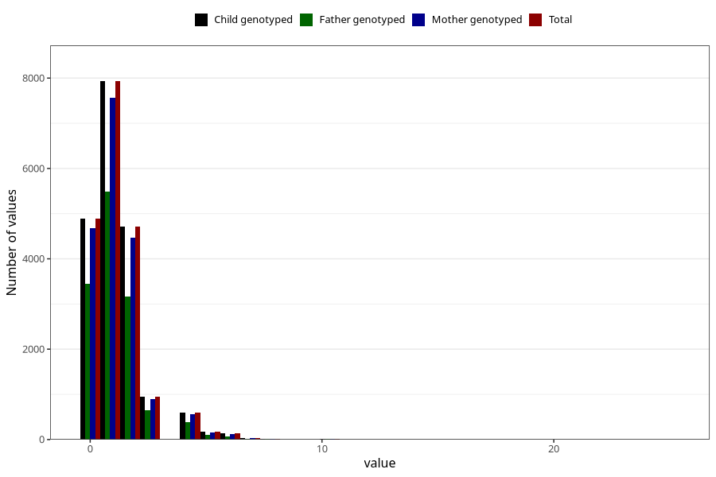

# n_slices_crisp_bread_7y
Variable mapping to `JJ342` in `Skjema7aar_v12`.
- Number of values:

| Value | Total | Child genotyped | Mother genotyped | Father genotyped |
| ----- | ----- | --------------- | ---------------- | ---------------- |
| Missing | 55852 | 55852 | 53142 | 36702 |
| Non-missing | 19456 | 19456 | 18508 | 13382 |
| 0 | 4897 | 4897 | 4672 | 3455 |
| 1 | 7930 | 7930 | 7558 | 5491 |
| 2 | 4713 | 4713 | 4470 | 3159 |
| 3 | 941 | 941 | 898 | 654 |
| 4 | 596 | 596 | 558 | 377 |
| 5 | 166 | 166 | 154 | 110 |
| 6 | 130 | 130 | 123 | 76 |
| 7 | 35 | 35 | 33 | 24 |
| 8 | 23 | 23 | 20 | 14 |
| 9 | 3 | 3 | 3 | 3 |
| 10 | 10 | 10 | 10 | 10 |
| 12 | 2 | 2 | 2 | 2 |
| 14 | 4 | 4 | 4 | 3 |
| 15 | 1 | 1 | 0 | 0 |
| 16 | 1 | 1 | 0 | 1 |
| 20 | 3 | 3 | 3 | 2 |
| 25 | 1 | 1 | 0 | 1 |

