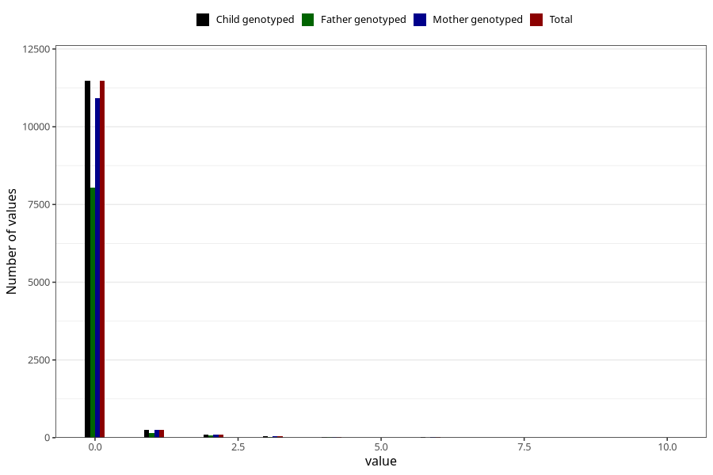

# n_slices_white_bread_daily_7y
Variable mapping to `JJ339` in `Skjema7aar_v12`.
- Number of values:

| Value | Total | Child genotyped | Mother genotyped | Father genotyped |
| ----- | ----- | --------------- | ---------------- | ---------------- |
| Missing | 63384 | 63384 | 60304 | 41777 |
| Non-missing | 11924 | 11924 | 11346 | 8307 |
| 0 | 11474 | 11474 | 10913 | 8030 |
| 1 | 251 | 251 | 242 | 153 |
| 2 | 104 | 104 | 101 | 65 |
| 3 | 42 | 42 | 39 | 25 |
| 4 | 32 | 32 | 31 | 19 |
| 5 | 7 | 7 | 6 | 6 |
| 6 | 10 | 10 | 10 | 6 |
| 7 | 2 | 2 | 2 | 1 |
| 8 | 1 | 1 | 1 | 1 |
| 10 | 1 | 1 | 1 | 1 |

