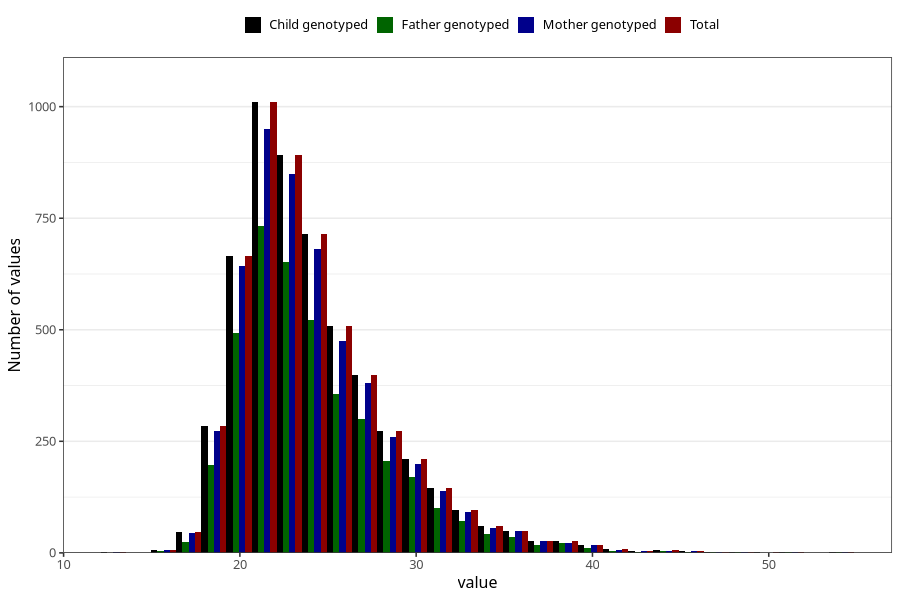

# mother_bmi_before
Variable mapping to `KMI_FOER` in `MFR_541_v12`.
- Number of values:

| Value | Total | Child genotyped | Mother genotyped | Father genotyped |
| ----- | ----- | --------------- | ---------------- | ---------------- |
| Missing | 69842 | 69842 | 66456 | 46103 |
| Non-missing | 5466 | 5466 | 5194 | 3981 |
| 25th percentile | 21.23 | 21.23 | 21.22 | 21.26 |
| 50th percentile | 23.18 | 23.18 | 23.15 | 23.23 |
| 75th percentile | 26.2825 | 26.2825 | 26.245 | 26.37 |
| Mean | 24.2093944383461 | 24.2093944383461 | 24.1776164805545 | 24.2458779201206 |
| Standard deviation | 4.37961931476762 | 4.37961931476762 | 4.34763278799385 | 4.35027361400993 |
| N | 5466 | 5466 | 5194 | 3981 |

