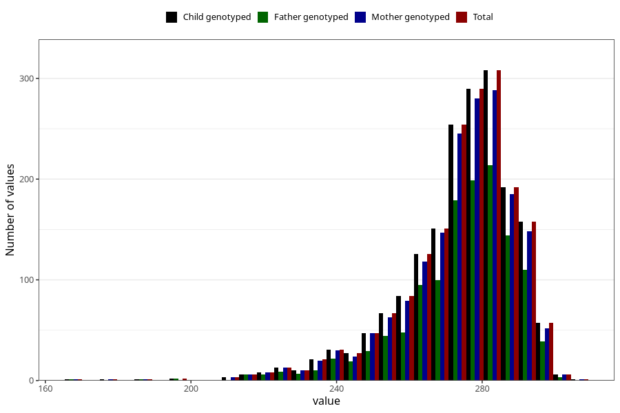

# pregnancy_duration_art
Variable mapping to `SVLEN_ART_DG` in `MFR_541_v12`.
- Number of values:

| Value | Total | Child genotyped | Mother genotyped | Father genotyped |
| ----- | ----- | --------------- | ---------------- | ---------------- |
| Missing | 73443 | 73443 | 69874 | 48797 |
| Non-missing | 1865 | 1865 | 1776 | 1287 |
| 25th percentile | 267 | 267 | 267 | 268 |
| 50th percentile | 277 | 277 | 277 | 277 |
| 75th percentile | 284 | 284 | 284 | 285 |
| Mean | 273.769973190349 | 273.769973190349 | 273.74268018018 | 274.076923076923 |
| Standard deviation | 16.0303212978186 | 16.0303212978186 | 15.8964502165938 | 15.9152446215883 |
| N | 1865 | 1865 | 1776 | 1287 |

