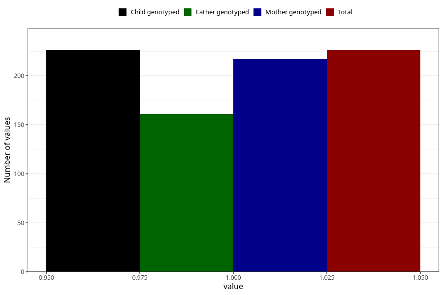

# diabetes_insulin_before
Variable mapping to `AA509` in `Skjema1_v12`.
- Number of values:

| Value | Total | Child genotyped | Mother genotyped | Father genotyped |
| ----- | ----- | --------------- | ---------------- | ---------------- |
| Missing | 75082 | 75082 | 71433 | 49923 |
| Non-missing | 226 | 226 | 217 | 161 |
| 1 | 226 | 226 | 217 | 161 |

