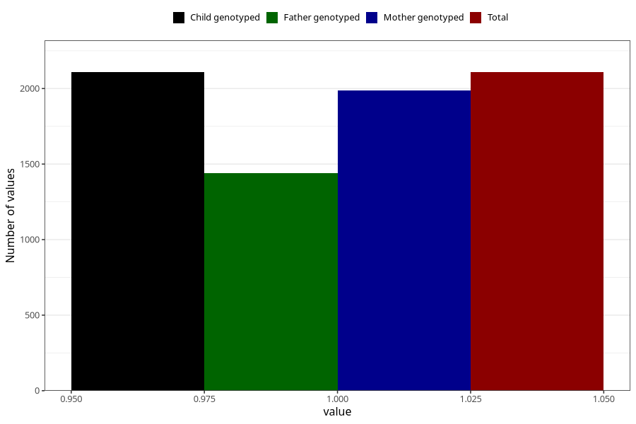

# eating_disorders_before
Variable mapping to `AA806` in `Skjema1_v12`.
- Number of values:

| Value | Total | Child genotyped | Mother genotyped | Father genotyped |
| ----- | ----- | --------------- | ---------------- | ---------------- |
| Missing | 73200 | 73200 | 69664 | 48643 |
| Non-missing | 2108 | 2108 | 1986 | 1441 |
| 1 | 2108 | 2108 | 1986 | 1441 |

