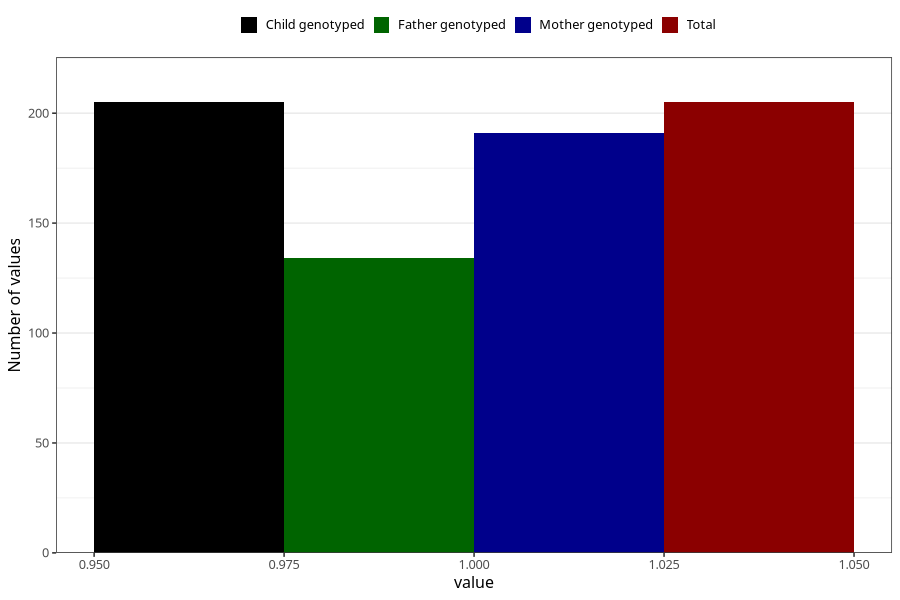

# eating_disorders_during
Variable mapping to `AA807` in `Skjema1_v12`.
- Number of values:

| Value | Total | Child genotyped | Mother genotyped | Father genotyped |
| ----- | ----- | --------------- | ---------------- | ---------------- |
| Missing | 75103 | 75103 | 71459 | 49950 |
| Non-missing | 205 | 205 | 191 | 134 |
| 1 | 205 | 205 | 191 | 134 |

