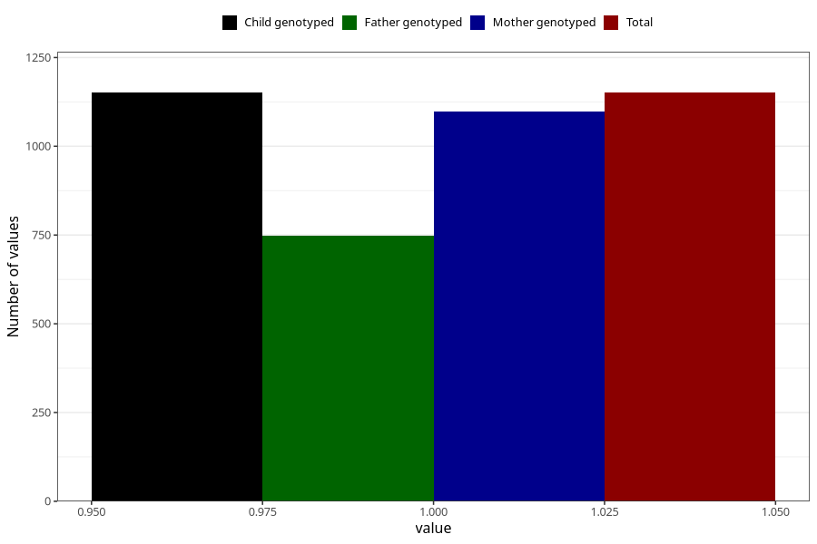

# endometriosis_before
Variable mapping to `AA689` in `Skjema1_v12`.
- Number of values:

| Value | Total | Child genotyped | Mother genotyped | Father genotyped |
| ----- | ----- | --------------- | ---------------- | ---------------- |
| Missing | 74157 | 74157 | 70551 | 49335 |
| Non-missing | 1151 | 1151 | 1099 | 749 |
| 1 | 1151 | 1151 | 1099 | 749 |

