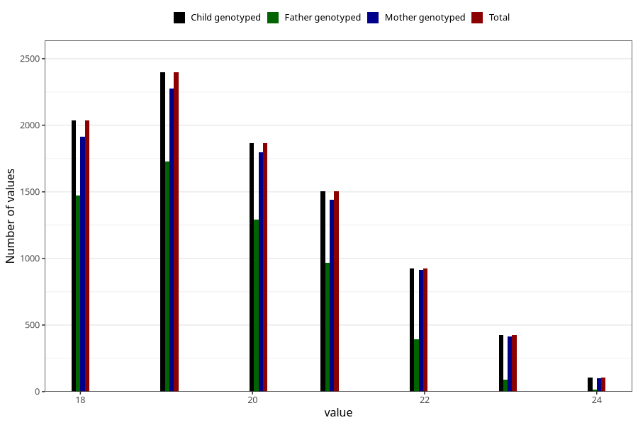

# age_answering_q_ung
Variable mapping to `AGE_YRS_UH` in `UngHelse_standard`.
- Number of values:

| Value | Total | Child genotyped | Mother genotyped | Father genotyped |
| ----- | ----- | --------------- | ---------------- | ---------------- |
| Missing | 66046 | 66046 | 62790 | 44127 |
| Non-missing | 9262 | 9262 | 8860 | 5957 |
| 18 | 2038 | 2038 | 1912 | 1474 |
| 19 | 2397 | 2397 | 2277 | 1728 |
| 20 | 1865 | 1865 | 1799 | 1291 |
| 21 | 1505 | 1505 | 1441 | 968 |
| 22 | 927 | 927 | 916 | 391 |
| 23 | 425 | 425 | 413 | 88 |
| 24 | 105 | 105 | 102 | 17 |

