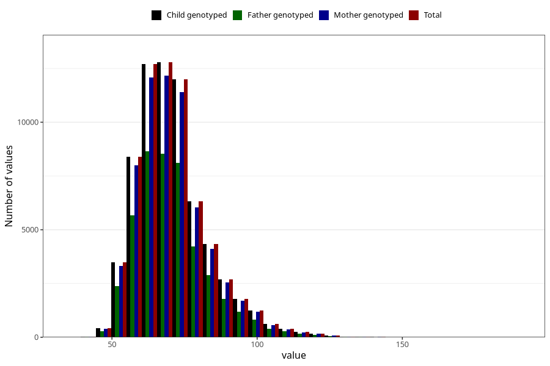

# mother_weight_15w
Variable mapping to `AA86` in `Skjema1_v12`.
- Number of values:

| Value | Total | Child genotyped | Mother genotyped | Father genotyped |
| ----- | ----- | --------------- | ---------------- | ---------------- |
| Missing | 7531 | 7531 | 7162 | 4555 |
| Non-missing | 67777 | 67777 | 64488 | 45529 |
| 25th percentile | 63 | 63 | 63 | 62 |
| 50th percentile | 69 | 69 | 69 | 69 |
| 75th percentile | 77 | 77 | 77 | 77 |
| Mean | 71.0746713486876 | 71.0746713486876 | 71.0607709961543 | 70.9729622877726 |
| Standard deviation | 12.4002423330959 | 12.4002423330959 | 12.3796201325524 | 12.3133773205745 |
| N | 67777 | 67777 | 64488 | 45529 |

