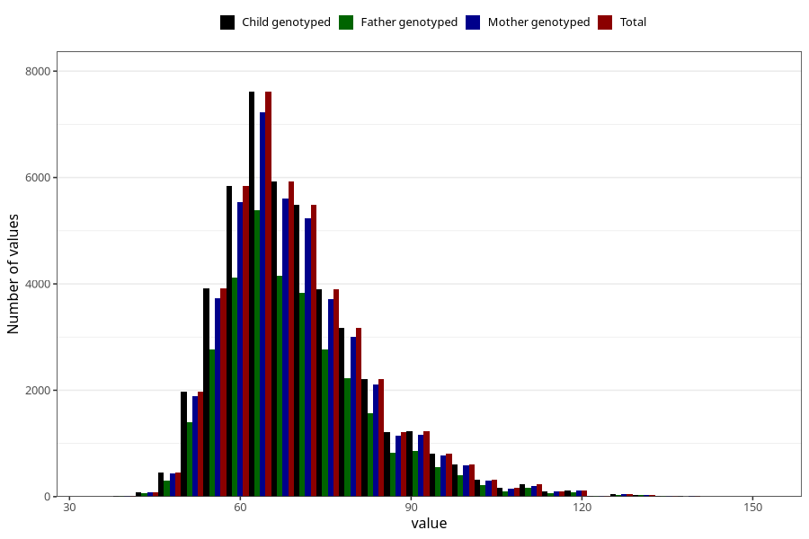

# mother_weight_18m
Variable mapping to `EE924` in `Skjema5_18mnd_v12`.
- Number of values:

| Value | Total | Child genotyped | Mother genotyped | Father genotyped |
| ----- | ----- | --------------- | ---------------- | ---------------- |
| Missing | 29775 | 29775 | 28381 | 18131 |
| Non-missing | 45533 | 45533 | 43269 | 31953 |
| 25th percentile | 61 | 61 | 61 | 61 |
| 50th percentile | 67.5 | 67.5 | 67.5 | 67.2 |
| 75th percentile | 76 | 76 | 76 | 76 |
| Mean | 69.7058485054795 | 69.7058485054795 | 69.6894682104971 | 69.6083904484712 |
| Standard deviation | 12.8479838333725 | 12.8479838333725 | 12.8366483109893 | 12.7361607127433 |
| N | 45533 | 45533 | 43269 | 31953 |

