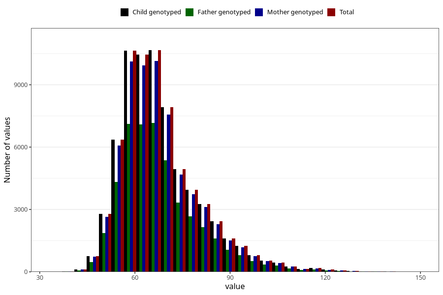

# mother_weight_beginning_self
Variable mapping to `AA85` in `Skjema1_v12`.
- Number of values:

| Value | Total | Child genotyped | Mother genotyped | Father genotyped |
| ----- | ----- | --------------- | ---------------- | ---------------- |
| Missing | 5568 | 5568 | 5287 | 3249 |
| Non-missing | 69740 | 69740 | 66363 | 46835 |
| 25th percentile | 60 | 60 | 60 | 60 |
| 50th percentile | 66 | 66 | 66 | 66 |
| 75th percentile | 74 | 74 | 74 | 74 |
| Mean | 68.178936048179 | 68.178936048179 | 68.1618070310263 | 68.1382299562293 |
| Standard deviation | 12.6220348548689 | 12.6220348548689 | 12.600867862631 | 12.5527601576101 |
| N | 69740 | 69740 | 66363 | 46835 |

