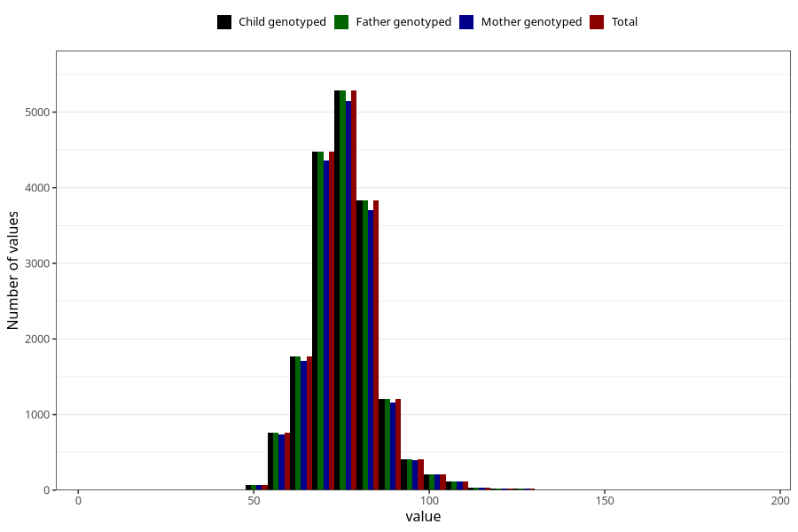

# weight_age_18_father15
Variable mapping to `G__7_1` in `Far2_V12`.
- Number of values:

| Value | Total | Child genotyped | Mother genotyped | Father genotyped |
| ----- | ----- | --------------- | ---------------- | ---------------- |
| Missing | 57076 | 57076 | 53950 | 31852 |
| Non-missing | 18232 | 18232 | 17700 | 18232 |
| 25th percentile | 70 | 70 | 70 | 70 |
| 50th percentile | 75 | 75 | 75 | 75 |
| 75th percentile | 80 | 80 | 80 | 80 |
| Mean | 75.6684949539272 | 75.6684949539272 | 75.6553107344633 | 75.6684949539272 |
| Standard deviation | 9.69644132436993 | 9.69644132436993 | 9.66908855906116 | 9.69644132436993 |
| N | 18232 | 18232 | 17700 | 18232 |

