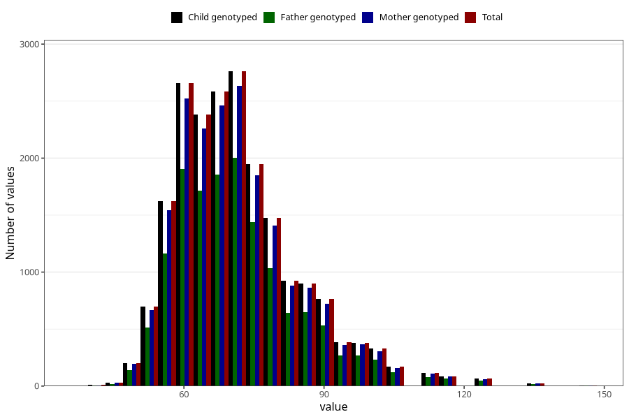

# weight_mother_14m
Variable mapping to `UM272` in `Ungdomsskjema_Mor_v12_standard`.
- Number of values:

| Value | Total | Child genotyped | Mother genotyped | Father genotyped |
| ----- | ----- | --------------- | ---------------- | ---------------- |
| Missing | 54783 | 54783 | 52136 | 35355 |
| Non-missing | 20525 | 20525 | 19514 | 14729 |
| 25th percentile | 62 | 62 | 62 | 62 |
| 50th percentile | 70 | 70 | 70 | 70 |
| 75th percentile | 79 | 79 | 79 | 78 |
| Mean | 71.7363702801462 | 71.7363702801462 | 71.7262478220765 | 71.6877588430986 |
| Standard deviation | 13.1992778758707 | 13.1992778758707 | 13.1862150716973 | 13.1772559179798 |
| N | 20525 | 20525 | 19514 | 14729 |

