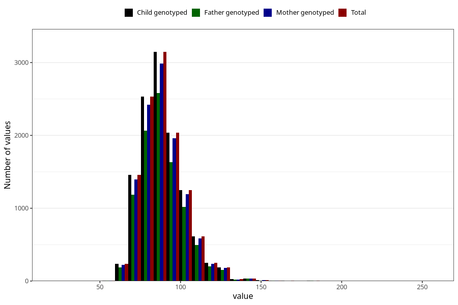

# weight_now_45f
Variable mapping to `LF34` in `MobaForeldre45_Far_v12_standard`.
- Number of values:

| Value | Total | Child genotyped | Mother genotyped | Father genotyped |
| ----- | ----- | --------------- | ---------------- | ---------------- |
| Missing | 63493 | 63493 | 60371 | 40474 |
| Non-missing | 11815 | 11815 | 11279 | 9610 |
| 25th percentile | 80 | 80 | 80 | 80 |
| 50th percentile | 88 | 88 | 88 | 87 |
| 75th percentile | 96 | 96 | 96 | 96 |
| Mean | 89.3975962759204 | 89.3975962759204 | 89.3756184058871 | 89.3803433922997 |
| Standard deviation | 13.9597679793068 | 13.9597679793068 | 13.8341953663665 | 13.9372518437034 |
| N | 11815 | 11815 | 11279 | 9610 |

