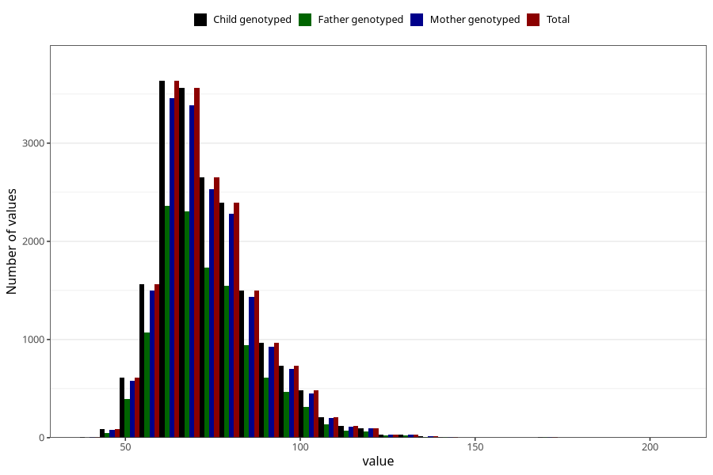

# weight_now_45m
Variable mapping to `LM29` in `MobaForeldre45_Mor_v12_standard`.
- Number of values:

| Value | Total | Child genotyped | Mother genotyped | Father genotyped |
| ----- | ----- | --------------- | ---------------- | ---------------- |
| Missing | 56608 | 56608 | 53825 | 37940 |
| Non-missing | 18700 | 18700 | 17825 | 12144 |
| 25th percentile | 64 | 64 | 64 | 64 |
| 50th percentile | 71 | 71 | 71 | 71 |
| 75th percentile | 80 | 80 | 80 | 80 |
| Mean | 73.762385026738 | 73.762385026738 | 73.7622384291725 | 73.6348155467721 |
| Standard deviation | 13.9896627082046 | 13.9896627082046 | 13.9702066060179 | 14.0204568720964 |
| N | 18700 | 18700 | 17825 | 12144 |

