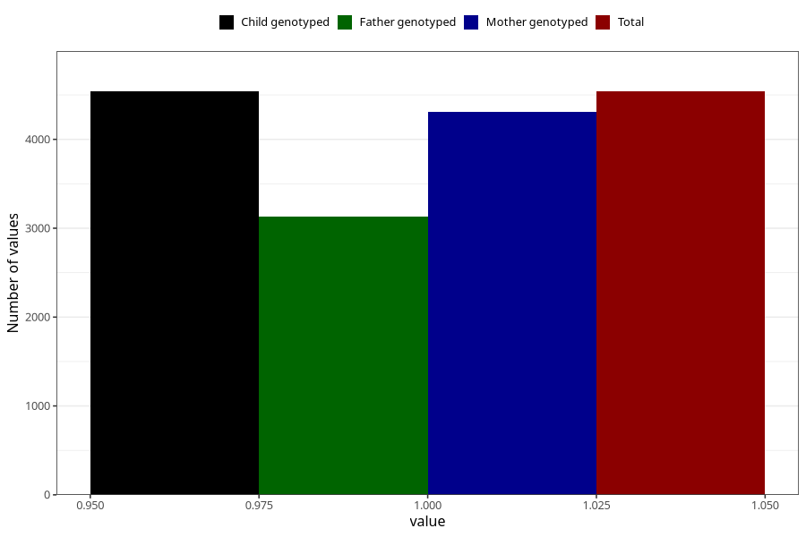

# abdominal_pain_before_4w
Variable mapping to `AA186` in `Skjema1_v12`.
- Number of values:

| Value | Total | Child genotyped | Mother genotyped | Father genotyped |
| ----- | ----- | --------------- | ---------------- | ---------------- |
| Missing | 70769 | 70769 | 67345 | 46949 |
| Non-missing | 4539 | 4539 | 4305 | 3135 |
| 1 | 4539 | 4539 | 4305 | 3135 |

