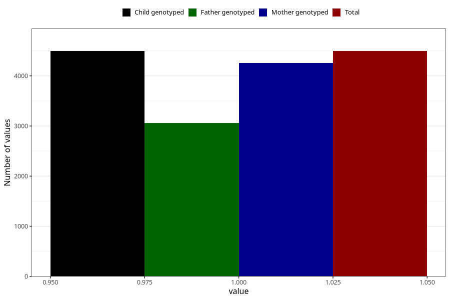

# blood_haemoglobin_dont_know_30w
Variable mapping to `CC130` in `Skjema3_v12`.
- Number of values:

| Value | Total | Child genotyped | Mother genotyped | Father genotyped |
| ----- | ----- | --------------- | ---------------- | ---------------- |
| Missing | 70815 | 70815 | 67399 | 47024 |
| Non-missing | 4493 | 4493 | 4251 | 3060 |
| 1 | 4493 | 4493 | 4251 | 3060 |

