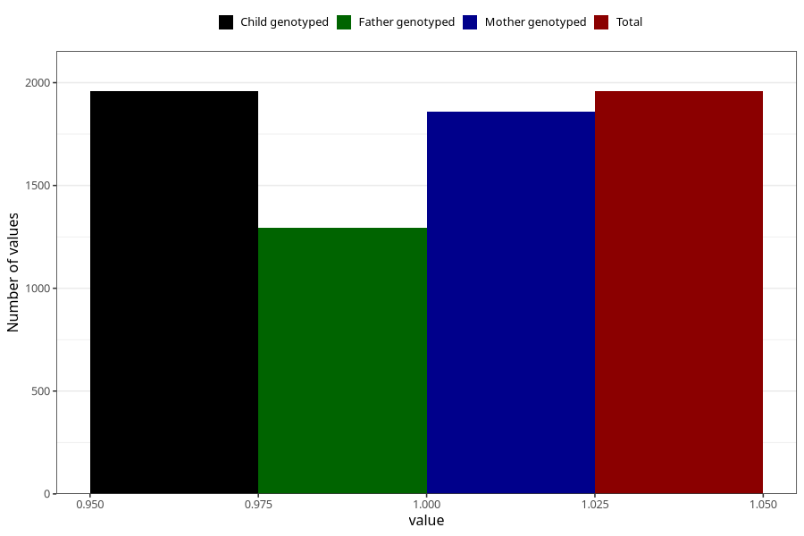

# diarrhoea_after_29w
Variable mapping to `CC452` in `Skjema3_v12`.
- Number of values:

| Value | Total | Child genotyped | Mother genotyped | Father genotyped |
| ----- | ----- | --------------- | ---------------- | ---------------- |
| Missing | 73350 | 73350 | 69792 | 48789 |
| Non-missing | 1958 | 1958 | 1858 | 1295 |
| 1 | 1958 | 1958 | 1858 | 1295 |

