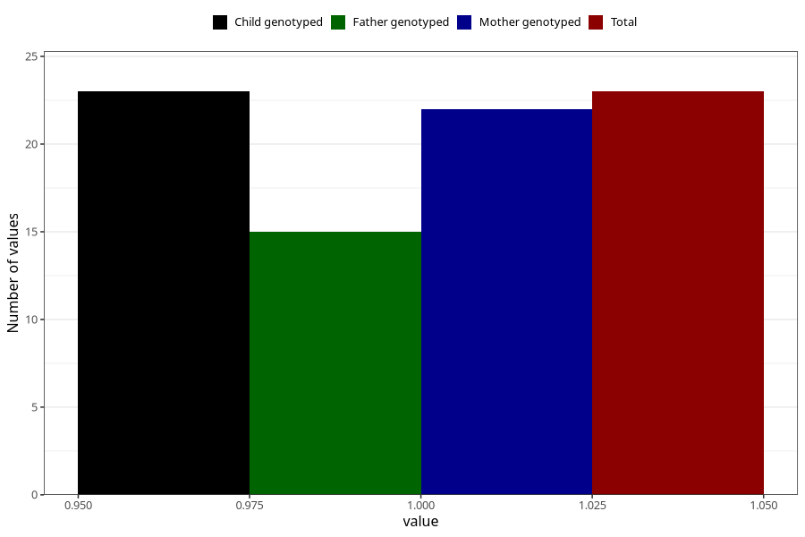

# hospitalized_amniotic_fluid_leakage_after_29w
Variable mapping to `CC163` in `Skjema3_v12`.
- Number of values:

| Value | Total | Child genotyped | Mother genotyped | Father genotyped |
| ----- | ----- | --------------- | ---------------- | ---------------- |
| Missing | 75285 | 75285 | 71628 | 50069 |
| Non-missing | 23 | 23 | 22 | 15 |
| 1 | 23 | 23 | 22 | 15 |

