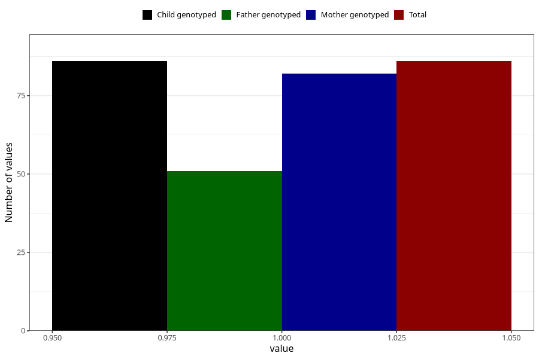

# hospitalized_bleeding_13_16w
Variable mapping to `CC150` in `Skjema3_v12`.
- Number of values:

| Value | Total | Child genotyped | Mother genotyped | Father genotyped |
| ----- | ----- | --------------- | ---------------- | ---------------- |
| Missing | 75222 | 75222 | 71568 | 50033 |
| Non-missing | 86 | 86 | 82 | 51 |
| 1 | 86 | 86 | 82 | 51 |

