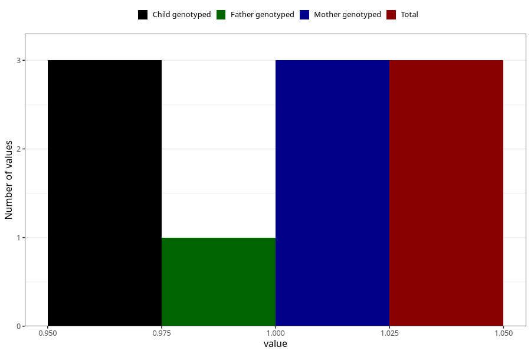

# hospitalized_high_blood_pressure_5_8w
Variable mapping to `CC175` in `Skjema3_v12`.
- Number of values:

| Value | Total | Child genotyped | Mother genotyped | Father genotyped |
| ----- | ----- | --------------- | ---------------- | ---------------- |
| Missing | 75305 | 75305 | 71647 | 50083 |
| Non-missing | 3 | 3 | 3 | 1 |
| 1 | 3 | 3 | 3 | 1 |

