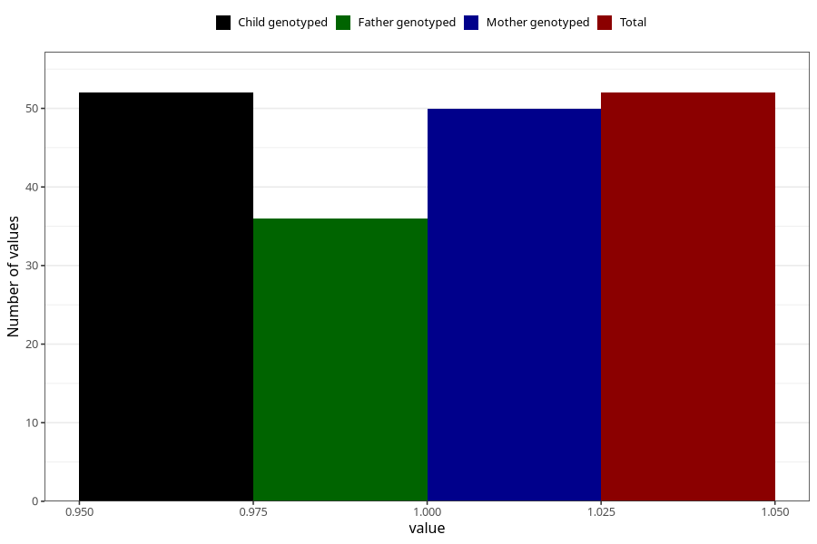

# hospitalized_pre_eclampsia
Variable mapping to `CC182` in `Skjema3_v12`.
- Number of values:

| Value | Total | Child genotyped | Mother genotyped | Father genotyped |
| ----- | ----- | --------------- | ---------------- | ---------------- |
| Missing | 75256 | 75256 | 71600 | 50048 |
| Non-missing | 52 | 52 | 50 | 36 |
| 1 | 52 | 52 | 50 | 36 |

