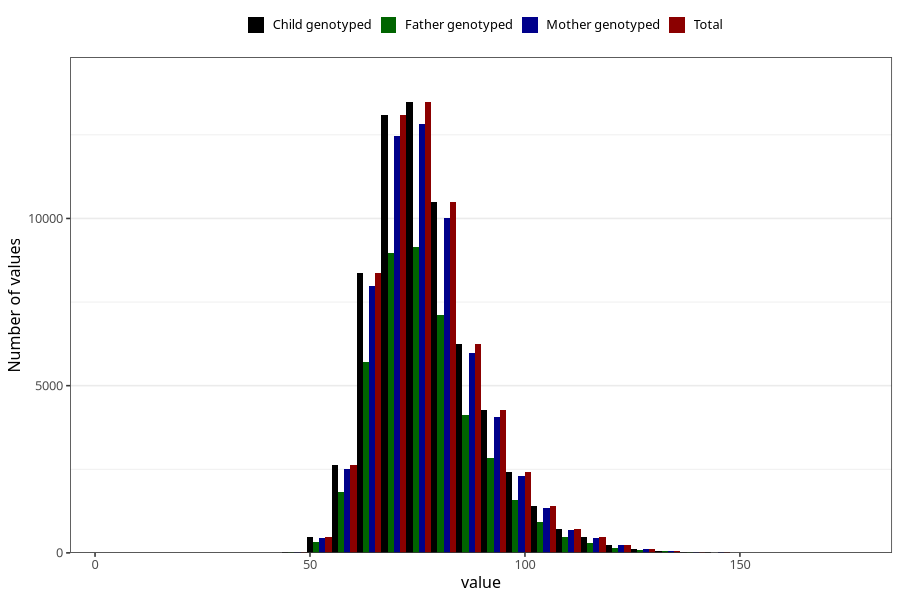

# mother_weight_last_check_30w
Variable mapping to `CC131` in `Skjema3_v12`.
- Number of values:

| Value | Total | Child genotyped | Mother genotyped | Father genotyped |
| ----- | ----- | --------------- | ---------------- | ---------------- |
| Missing | 10695 | 10695 | 10108 | 6384 |
| Non-missing | 64613 | 64613 | 61542 | 43700 |
| 25th percentile | 69 | 69 | 69 | 68.9 |
| 50th percentile | 75.7 | 75.7 | 75.7 | 75.5 |
| 75th percentile | 84 | 84 | 84 | 84 |
| Mean | 77.5422562023122 | 77.5422562023122 | 77.5238763771083 | 77.3813684210526 |
| Standard deviation | 12.4638337929475 | 12.4638337929475 | 12.4471434470489 | 12.395524049322 |
| N | 64613 | 64613 | 61542 | 43700 |

