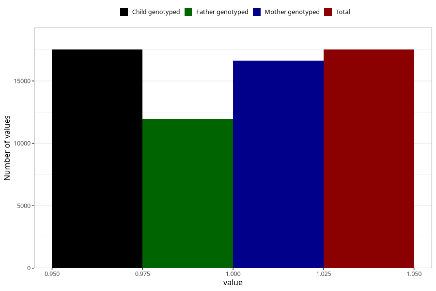

# nausea_13w_15w
Variable mapping to `AA219` in `Skjema1_v12`.
- Number of values:

| Value | Total | Child genotyped | Mother genotyped | Father genotyped |
| ----- | ----- | --------------- | ---------------- | ---------------- |
| Missing | 57792 | 57792 | 55020 | 38127 |
| Non-missing | 17516 | 17516 | 16630 | 11957 |
| 1 | 17516 | 17516 | 16630 | 11957 |

