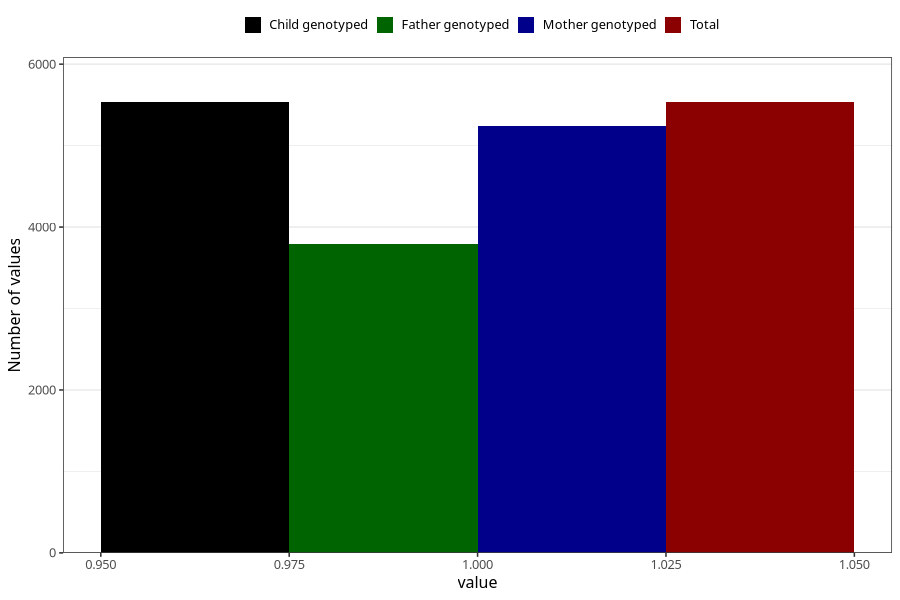

# neck_shoulder_pain_9w_12w
Variable mapping to `AA208` in `Skjema1_v12`.
- Number of values:

| Value | Total | Child genotyped | Mother genotyped | Father genotyped |
| ----- | ----- | --------------- | ---------------- | ---------------- |
| Missing | 69775 | 69775 | 66406 | 46292 |
| Non-missing | 5533 | 5533 | 5244 | 3792 |
| 1 | 5533 | 5533 | 5244 | 3792 |

