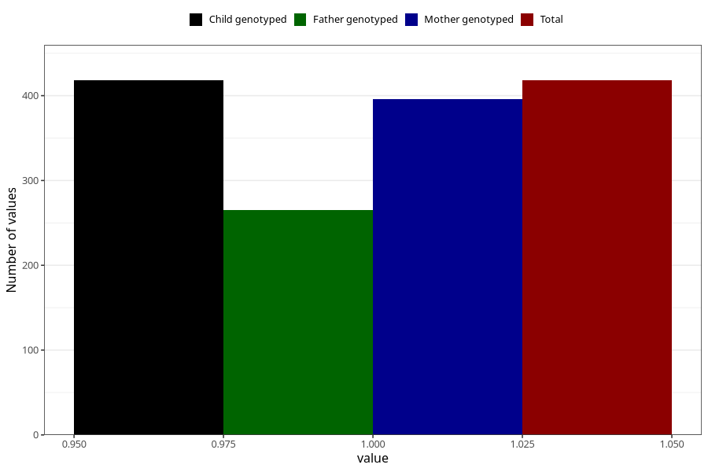

# oedema_5w_8w
Variable mapping to `AA317` in `Skjema1_v12`.
- Number of values:

| Value | Total | Child genotyped | Mother genotyped | Father genotyped |
| ----- | ----- | --------------- | ---------------- | ---------------- |
| Missing | 74890 | 74890 | 71254 | 49819 |
| Non-missing | 418 | 418 | 396 | 265 |
| 1 | 418 | 418 | 396 | 265 |

