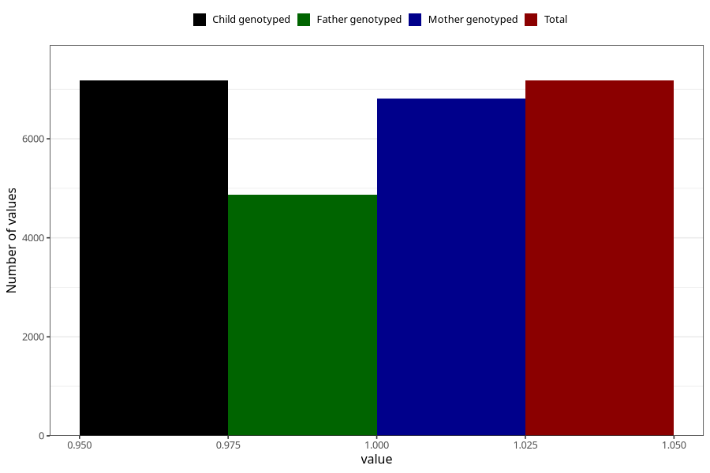

# other_muscle_joint_pain_25w_28w
Variable mapping to `CC367` in `Skjema3_v12`.
- Number of values:

| Value | Total | Child genotyped | Mother genotyped | Father genotyped |
| ----- | ----- | --------------- | ---------------- | ---------------- |
| Missing | 68132 | 68132 | 64843 | 45210 |
| Non-missing | 7176 | 7176 | 6807 | 4874 |
| 1 | 7176 | 7176 | 6807 | 4874 |

