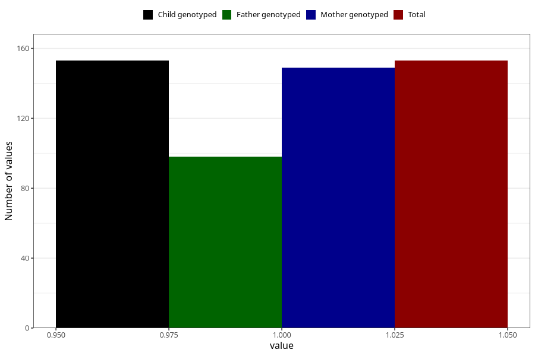

# pneumonia_bronchitis_before_4w
Variable mapping to `AA386` in `Skjema1_v12`.
- Number of values:

| Value | Total | Child genotyped | Mother genotyped | Father genotyped |
| ----- | ----- | --------------- | ---------------- | ---------------- |
| Missing | 75155 | 75155 | 71501 | 49986 |
| Non-missing | 153 | 153 | 149 | 98 |
| 1 | 153 | 153 | 149 | 98 |

