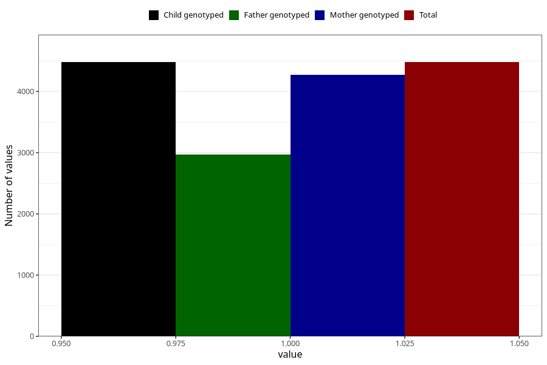

# pregnancy_itch_25w_28w
Variable mapping to `CC427` in `Skjema3_v12`.
- Number of values:

| Value | Total | Child genotyped | Mother genotyped | Father genotyped |
| ----- | ----- | --------------- | ---------------- | ---------------- |
| Missing | 70830 | 70830 | 67380 | 47118 |
| Non-missing | 4478 | 4478 | 4270 | 2966 |
| 1 | 4478 | 4478 | 4270 | 2966 |

