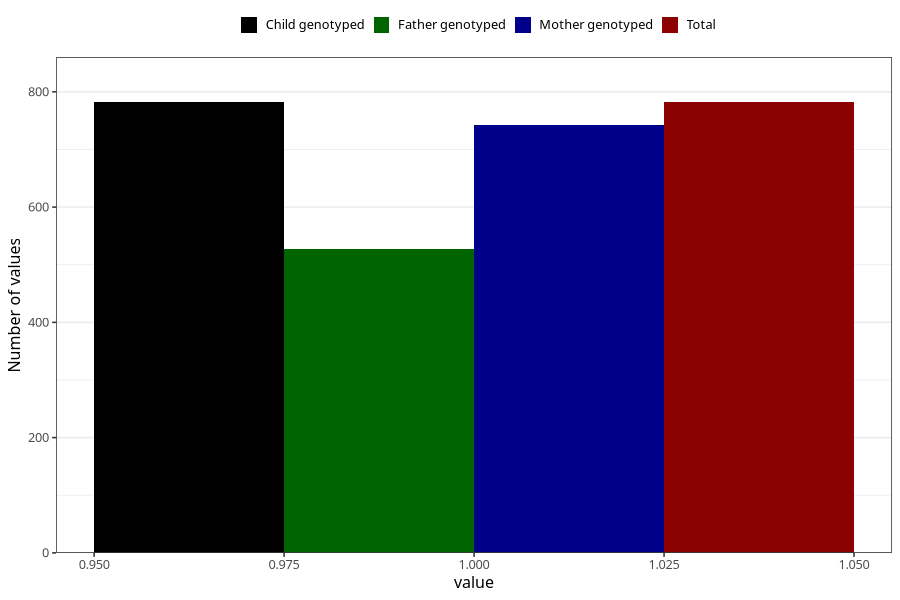

# sinusitis_ear_infection_5w_8w
Variable mapping to `AA367` in `Skjema1_v12`.
- Number of values:

| Value | Total | Child genotyped | Mother genotyped | Father genotyped |
| ----- | ----- | --------------- | ---------------- | ---------------- |
| Missing | 74526 | 74526 | 70907 | 49556 |
| Non-missing | 782 | 782 | 743 | 528 |
| 1 | 782 | 782 | 743 | 528 |

