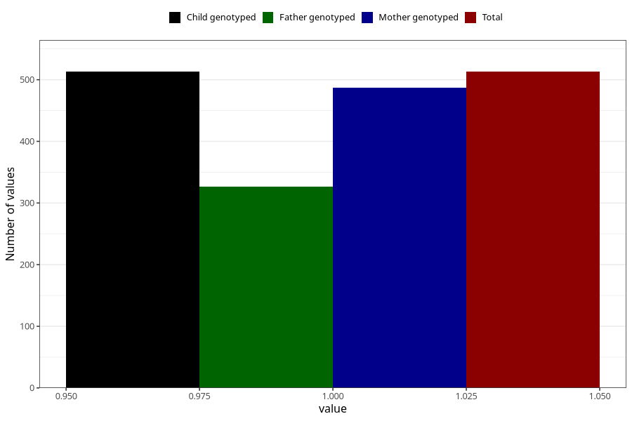

# sinusitis_ear_infection_before_4w
Variable mapping to `AA366` in `Skjema1_v12`.
- Number of values:

| Value | Total | Child genotyped | Mother genotyped | Father genotyped |
| ----- | ----- | --------------- | ---------------- | ---------------- |
| Missing | 74795 | 74795 | 71163 | 49757 |
| Non-missing | 513 | 513 | 487 | 327 |
| 1 | 513 | 513 | 487 | 327 |

