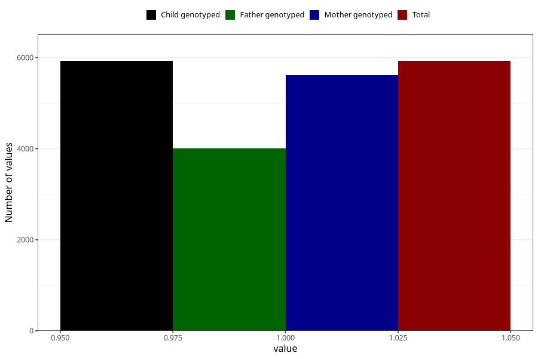

# sleeping_problems_9w_12w
Variable mapping to `AA298` in `Skjema1_v12`.
- Number of values:

| Value | Total | Child genotyped | Mother genotyped | Father genotyped |
| ----- | ----- | --------------- | ---------------- | ---------------- |
| Missing | 69385 | 69385 | 66028 | 46076 |
| Non-missing | 5923 | 5923 | 5622 | 4008 |
| 1 | 5923 | 5923 | 5622 | 4008 |

