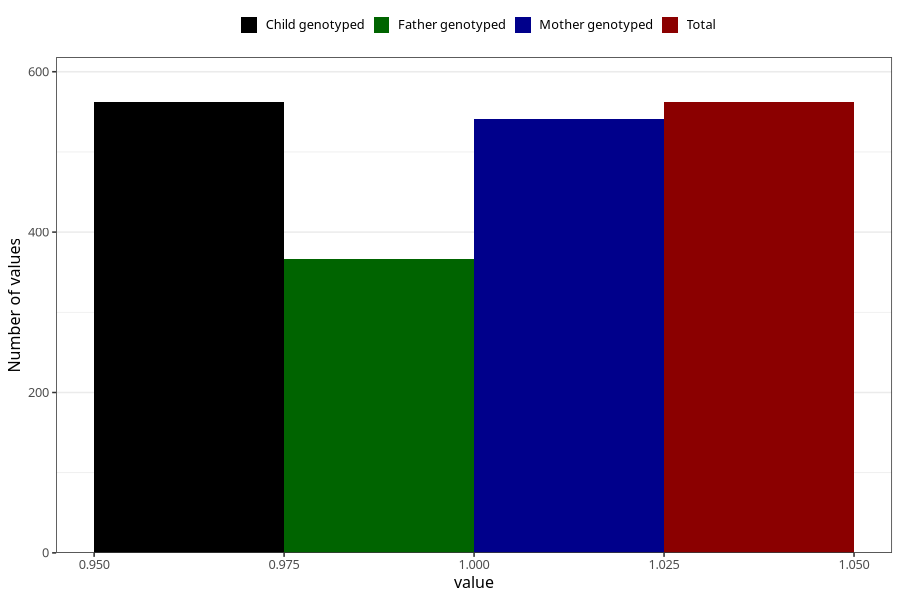

# vaginal_bleeding_1_after_29w
Variable mapping to `CC321` in `Skjema3_v12`.
- Number of values:

| Value | Total | Child genotyped | Mother genotyped | Father genotyped |
| ----- | ----- | --------------- | ---------------- | ---------------- |
| Missing | 74746 | 74746 | 71109 | 49717 |
| Non-missing | 562 | 562 | 541 | 367 |
| 1 | 562 | 562 | 541 | 367 |

