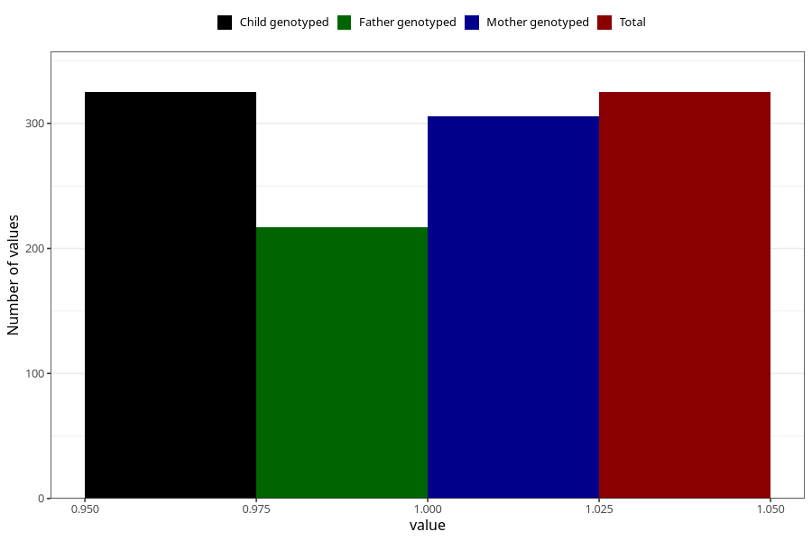

# vaginal_bleeding_2_13w_16w
Variable mapping to `CC324` in `Skjema3_v12`.
- Number of values:

| Value | Total | Child genotyped | Mother genotyped | Father genotyped |
| ----- | ----- | --------------- | ---------------- | ---------------- |
| Missing | 74983 | 74983 | 71344 | 49867 |
| Non-missing | 325 | 325 | 306 | 217 |
| 1 | 325 | 325 | 306 | 217 |

