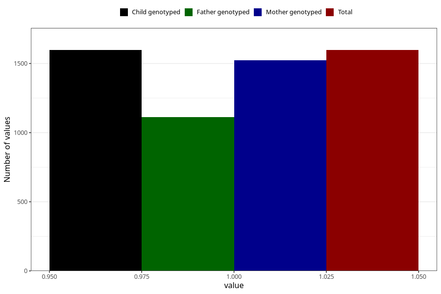

# vaginal_bleeding_know_why_intercourse
Variable mapping to `CC337` in `Skjema3_v12`.
- Number of values:

| Value | Total | Child genotyped | Mother genotyped | Father genotyped |
| ----- | ----- | --------------- | ---------------- | ---------------- |
| Missing | 73711 | 73711 | 70126 | 48973 |
| Non-missing | 1597 | 1597 | 1524 | 1111 |
| 1 | 1597 | 1597 | 1524 | 1111 |

