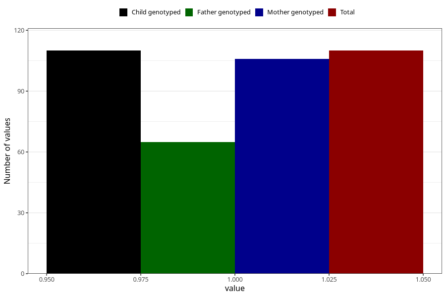

# vaginal_bleeding_know_why_threatening_miscarriage_premature_birth
Variable mapping to `CC335` in `Skjema3_v12`.
- Number of values:

| Value | Total | Child genotyped | Mother genotyped | Father genotyped |
| ----- | ----- | --------------- | ---------------- | ---------------- |
| Missing | 75198 | 75198 | 71544 | 50019 |
| Non-missing | 110 | 110 | 106 | 65 |
| 1 | 110 | 110 | 106 | 65 |

