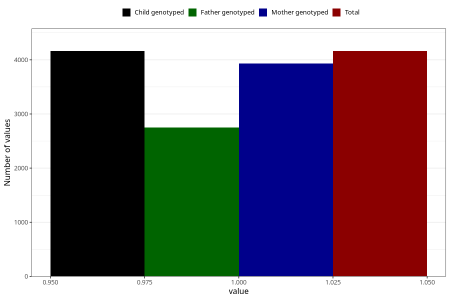

# vaginal_thrush_after_29w
Variable mapping to `CC404` in `Skjema3_v12`.
- Number of values:

| Value | Total | Child genotyped | Mother genotyped | Father genotyped |
| ----- | ----- | --------------- | ---------------- | ---------------- |
| Missing | 71147 | 71147 | 67714 | 47332 |
| Non-missing | 4161 | 4161 | 3936 | 2752 |
| 1 | 4161 | 4161 | 3936 | 2752 |

