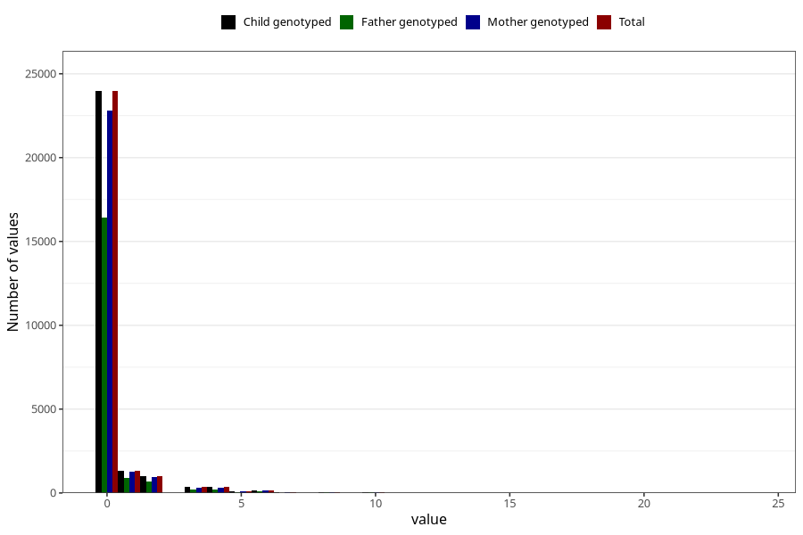

# coffee_before_boiled
Variable mapping to `AA1383` in `Skjema1_v12`.
- Number of values:

| Value | Total | Child genotyped | Mother genotyped | Father genotyped |
| ----- | ----- | --------------- | ---------------- | ---------------- |
| Missing | 47894 | 47894 | 45552 | 31384 |
| Non-missing | 27414 | 27414 | 26098 | 18700 |
| 0 | 23965 | 23965 | 22819 | 16434 |
| 1 | 1306 | 1306 | 1243 | 873 |
| 2 | 1015 | 1015 | 970 | 694 |
| 3 | 348 | 348 | 337 | 226 |
| 4 | 351 | 351 | 331 | 221 |
| 5 | 122 | 122 | 111 | 66 |
| 6 | 148 | 148 | 138 | 99 |
| 7 | 28 | 28 | 26 | 18 |
| 8 | 43 | 43 | 40 | 22 |
| 9 | 2 | 2 | 2 | 1 |
| 10 | 59 | 59 | 56 | 32 |
| 12 | 15 | 15 | 14 | 9 |
| 14 | 2 | 2 | 1 | 0 |
| 15 | 3 | 3 | 3 | 1 |
| 16 | 1 | 1 | 1 | 1 |
| 20 | 5 | 5 | 5 | 2 |
| 24 | 1 | 1 | 1 | 1 |

