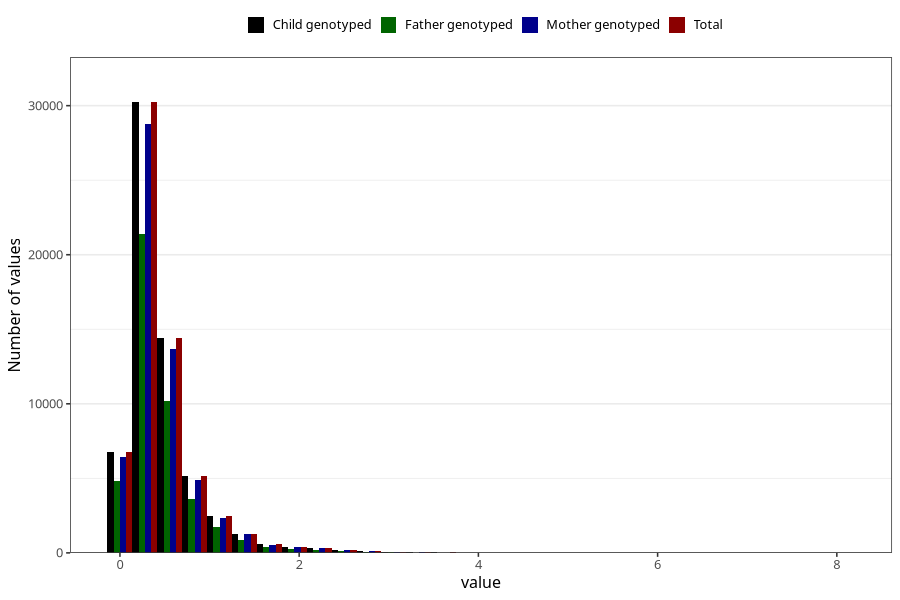

# food_LCn3_g_day
Variable mapping to `f_sum_LCn3` in `Skjema2_beregning_CDW_foody_fatty_acid_and_iodine_v12`.
- Number of values:

| Value | Total | Child genotyped | Mother genotyped | Father genotyped |
| ----- | ----- | --------------- | ---------------- | ---------------- |
| Missing | 13178 | 13178 | 12654 | 6217 |
| Non-missing | 62130 | 62130 | 58996 | 43867 |
| 25th percentile | 0.221825 | 0.221825 | 0.2216 | 0.22265 |
| 50th percentile | 0.3548 | 0.3548 | 0.3545 | 0.3554 |
| 75th percentile | 0.563775 | 0.563775 | 0.562425 | 0.56065 |
| Mean | 0.472835910188315 | 0.472835910188315 | 0.471918962302529 | 0.469427713315248 |
| Standard deviation | 0.435822092793601 | 0.435822092793601 | 0.434269682729162 | 0.427727109644222 |
| N | 62130 | 62130 | 58996 | 43867 |

