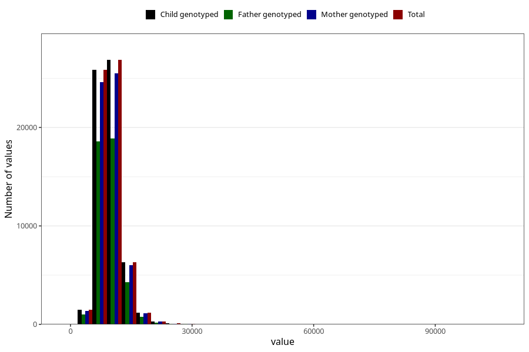

# food_kJ_day
Variable mapping to `f_kJ` in `Skjema2_beregning_CDW_caffeine_food_and_supplements_v12`.
- Number of values:

| Value | Total | Child genotyped | Mother genotyped | Father genotyped |
| ----- | ----- | --------------- | ---------------- | ---------------- |
| Missing | 13178 | 13178 | 12654 | 6217 |
| Non-missing | 62130 | 62130 | 58996 | 43867 |
| 25th percentile | 7898.43 | 7898.43 | 7894.9 | 7865 |
| 50th percentile | 9373.96 | 9373.96 | 9366.355 | 9319.04 |
| 75th percentile | 11156.09 | 11156.09 | 11152.4475 | 11078.235 |
| Mean | 9788.21572943827 | 9788.21572943827 | 9782.3519157231 | 9710.34889894454 |
| Standard deviation | 3015.53216906789 | 3015.53216906789 | 3002.64196547437 | 2924.99339632493 |
| N | 62130 | 62130 | 58996 | 43867 |

