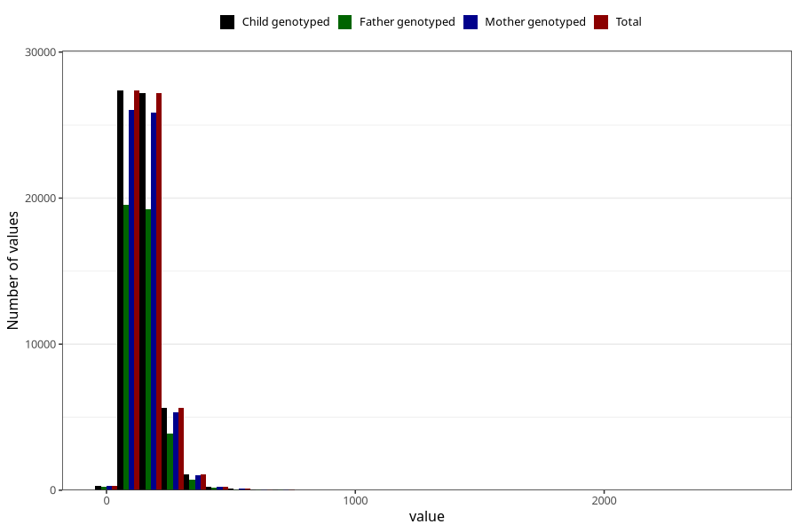

# mono_and_disaccharides
Variable mapping to `MONO_DISAKK` in `Skjema2_beregning_CDW_v12`.
- Number of values:

| Value | Total | Child genotyped | Mother genotyped | Father genotyped |
| ----- | ----- | --------------- | ---------------- | ---------------- |
| Missing | 13178 | 13178 | 12654 | 6217 |
| Non-missing | 62130 | 62130 | 58996 | 43867 |
| 25th percentile | 108.29 | 108.29 | 108.2275 | 107.655 |
| 50th percentile | 140.17 | 140.17 | 140.06 | 139.5 |
| 75th percentile | 180.79 | 180.79 | 180.69 | 179.54 |
| Mean | 152.444133107999 | 152.444133107999 | 152.306353312089 | 150.913775275264 |
| Standard deviation | 71.6962741650946 | 71.6962741650946 | 71.3790974512344 | 69.3138388896234 |
| N | 62130 | 62130 | 58996 | 43867 |

