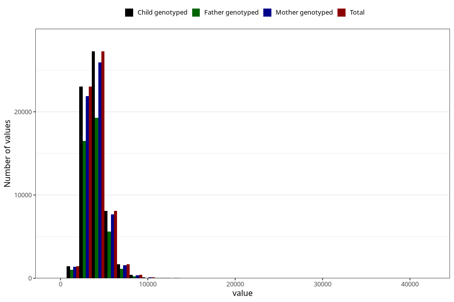

# potassium
Variable mapping to `KALIUM` in `Skjema2_beregning_CDW_v12`.
- Number of values:

| Value | Total | Child genotyped | Mother genotyped | Father genotyped |
| ----- | ----- | --------------- | ---------------- | ---------------- |
| Missing | 13178 | 13178 | 12654 | 6217 |
| Non-missing | 62130 | 62130 | 58996 | 43867 |
| 25th percentile | 3215.1325 | 3215.1325 | 3215.005 | 3203.96 |
| 50th percentile | 3869.83 | 3869.83 | 3869.44 | 3854.42 |
| 75th percentile | 4646.6875 | 4646.6875 | 4642.615 | 4618.765 |
| Mean | 4037.92522613874 | 4037.92522613874 | 4035.67735032884 | 4014.37282307885 |
| Standard deviation | 1282.19137028029 | 1282.19137028029 | 1278.47638453808 | 1255.58489761819 |
| N | 62130 | 62130 | 58996 | 43867 |

