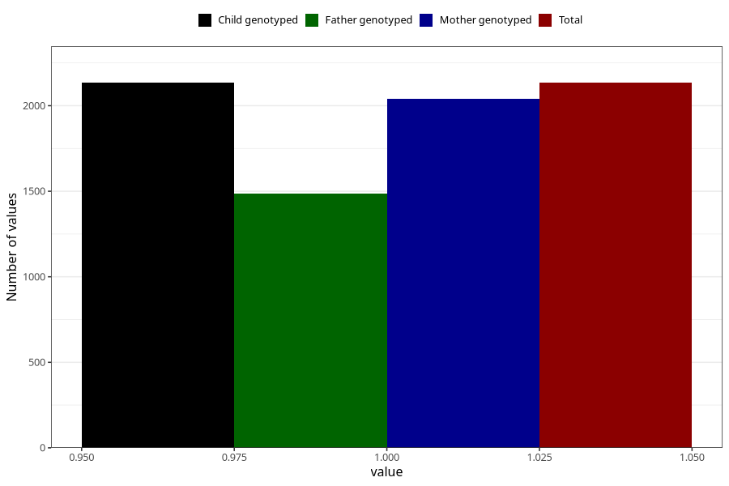

# tea_decaf
Variable mapping to `AA1388` in `Skjema1_v12`.
- Number of values:

| Value | Total | Child genotyped | Mother genotyped | Father genotyped |
| ----- | ----- | --------------- | ---------------- | ---------------- |
| Missing | 73174 | 73174 | 69612 | 48599 |
| Non-missing | 2134 | 2134 | 2038 | 1485 |
| 1 | 2134 | 2134 | 2038 | 1485 |

