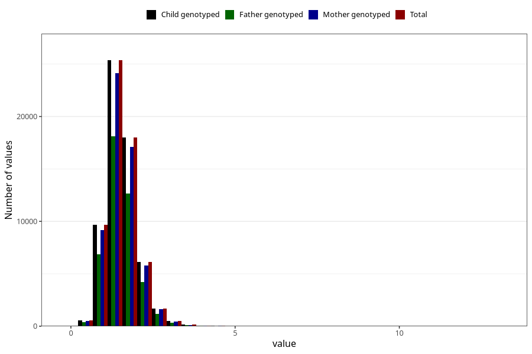

# thiamin
Variable mapping to `TIAMIN` in `Skjema2_beregning_CDW_v12`.
- Number of values:

| Value | Total | Child genotyped | Mother genotyped | Father genotyped |
| ----- | ----- | --------------- | ---------------- | ---------------- |
| Missing | 13178 | 13178 | 12654 | 6217 |
| Non-missing | 62130 | 62130 | 58996 | 43867 |
| 25th percentile | 1.23 | 1.23 | 1.23 | 1.23 |
| 50th percentile | 1.49 | 1.49 | 1.49 | 1.48 |
| 75th percentile | 1.79 | 1.79 | 1.79 | 1.79 |
| Mean | 1.5497440849831 | 1.5497440849831 | 1.54895620042037 | 1.54272117993024 |
| Standard deviation | 0.485278388032352 | 0.485278388032352 | 0.483707966067706 | 0.475556130412232 |
| N | 62130 | 62130 | 58996 | 43867 |

