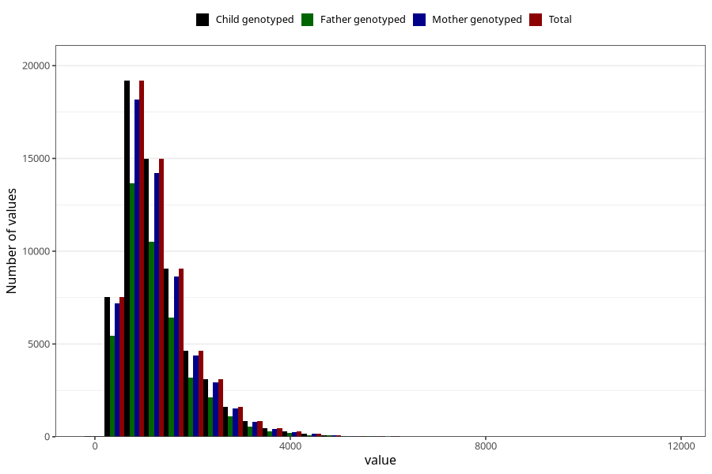

# total_retinol
Variable mapping to `RET_EKVIV` in `Skjema2_beregning_CDW_v12`.
- Number of values:

| Value | Total | Child genotyped | Mother genotyped | Father genotyped |
| ----- | ----- | --------------- | ---------------- | ---------------- |
| Missing | 13178 | 13178 | 12654 | 6217 |
| Non-missing | 62130 | 62130 | 58996 | 43867 |
| 25th percentile | 772.21 | 772.21 | 772.535 | 767.735 |
| 50th percentile | 1109.035 | 1109.035 | 1109.17 | 1102.14 |
| 75th percentile | 1595.165 | 1595.165 | 1595.2325 | 1581.205 |
| Mean | 1290.90463077418 | 1290.90463077418 | 1290.51138653468 | 1279.94367109672 |
| Standard deviation | 748.603800715844 | 748.603800715844 | 747.471288560415 | 740.159430938069 |
| N | 62130 | 62130 | 58996 | 43867 |

