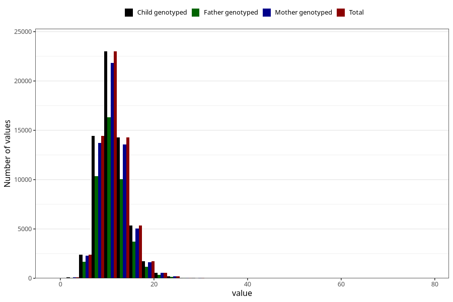

# zinc
Variable mapping to `SINK` in `Skjema2_beregning_CDW_v12`.
- Number of values:

| Value | Total | Child genotyped | Mother genotyped | Father genotyped |
| ----- | ----- | --------------- | ---------------- | ---------------- |
| Missing | 13178 | 13178 | 12654 | 6217 |
| Non-missing | 62130 | 62130 | 58996 | 43867 |
| 25th percentile | 9.2 | 9.2 | 9.2 | 9.18 |
| 50th percentile | 10.98 | 10.98 | 10.98 | 10.96 |
| 75th percentile | 13.04 | 13.04 | 13.03 | 12.98 |
| Mean | 11.3576283598906 | 11.3576283598906 | 11.3531041087531 | 11.3121334944263 |
| Standard deviation | 3.23959958580204 | 3.23959958580204 | 3.23221997666203 | 3.18513994566852 |
| N | 62130 | 62130 | 58996 | 43867 |

